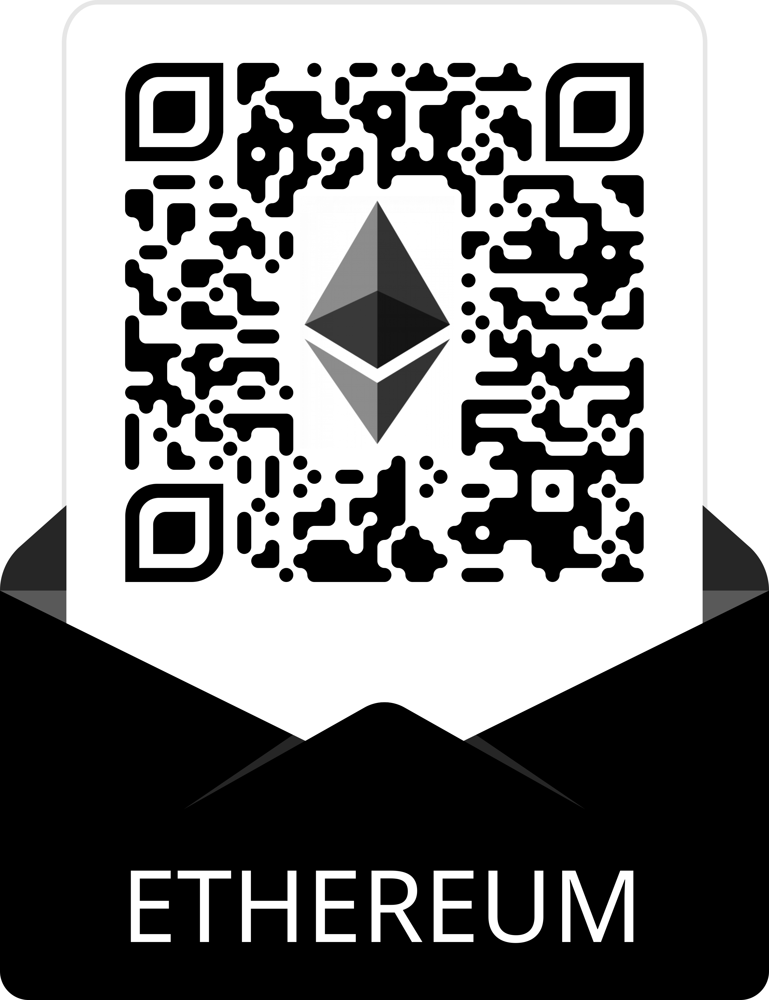

<h1>I ❤️ code.</h1>
<h4>I'm a full-stack developer with focuses on Blockchain / Golang development, and currently, I work at <a href="https://hermez.io">Hermez</a>.</h4>
<h6>📘&emsp;<a href="https://github.com/Pantani?tab=repositories&q=&type=&language=go">My Golang Projects</a></h6>

  
  
  

## 🏆 GitHub Trophies

## Donate

  
  

  

